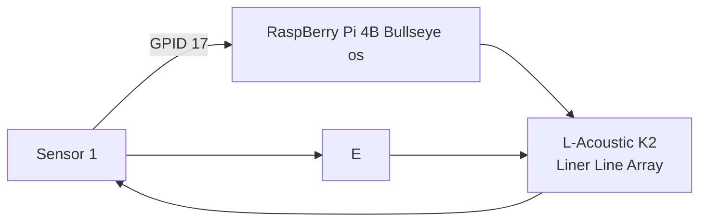
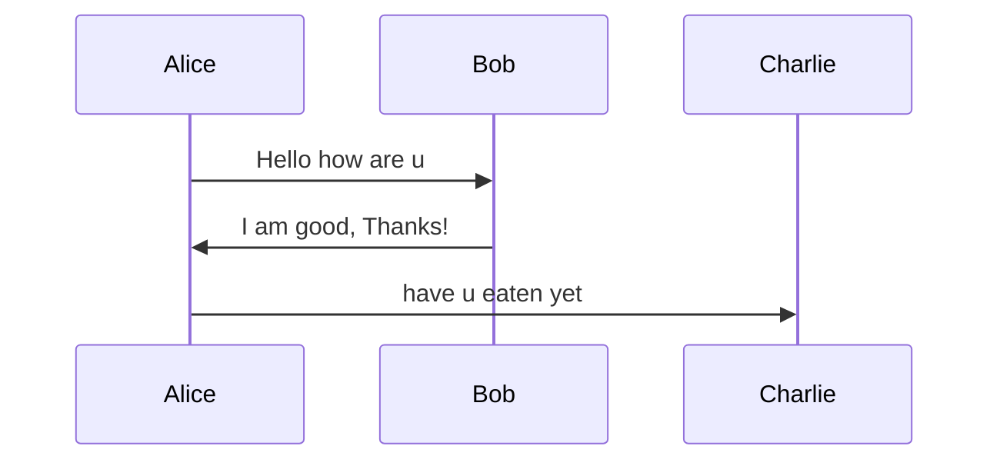

# HELLO
This is for **Heading 1**
## HELLO
This is for *Heading 2*
### HELLO
this is for ***Heading 3***

# list
1. ereree
     * ererererer 
2. rrrr
     * tttttttttt
3. tttt
     * erwdfw3r

# inserting a image
To insert a image you will need to drag and hold shift plus drop


[click here to link](https://www.instagram.com/reel/C-nrT7FyTol/)

[Click here to jump to tess.md](/tess/tess.md)

to highlight or insert a particular section of code, you can do the following

1. In raspberry pi, if you want to update, you will `sudo apt update`

```
from tkinter import

main =Tk()

Main.mainloop()
```

# Quates

A famous quote by **Sir ISSAC NEWTON**
> For every action, there will be a reaction.

# Tables

This is how u insert tables

|header a|header b|header c|
|-------|-------|-------|
|Row1|Data A|Data B|
|row2|    Data C|Data D|

```
|-----:|this is to justify right
```

# Horizontal Rule

This is how to add a section line
---

# Flow Chart



# Sequence Diagram


